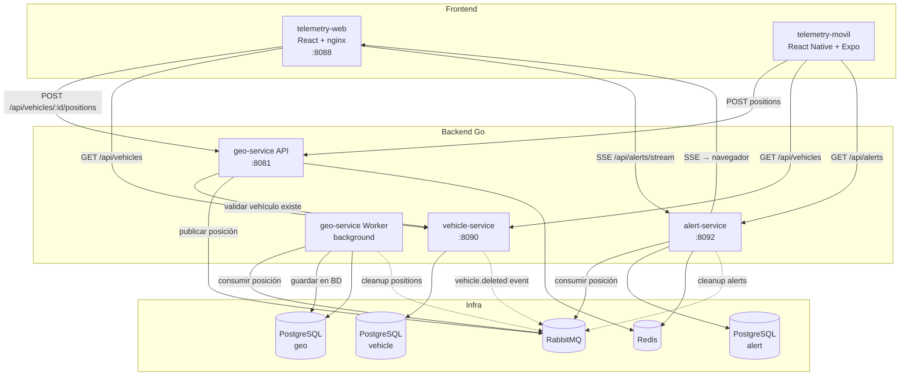

# Telemetry Platform

Plataforma de telemetría vehicular: 3 microservicios en Go + dashboard web en React + app móvil en React Native. Todo orquestado con Docker Compose.

## Tabla de Contenidos

1. [Arquitectura de Software](#1-arquitectura-de-software)
2. [Tolerancia a Fallos](#2-tolerancia-a-fallos)
3. [DevOps & CI/CD](#4-devops--cicd)
4. [Decisiones Técnicas](#5-decisiones-técnicas-por-qué-elegimos-x)
5. [Levantamiento Local](#6-levantamiento-local)
6. [Arquitectura Offline (App Móvil)](#7-arquitectura-offline-app-móvil)
7. [Reporte de IA](#9-reporte-de-ia)
8. [Desafíos y Soluciones](#10-desafíos-y-soluciones-qué-haría-diferente)
9. [Video de Sustentación](#11-video-de-sustentación)
10. [Estructura del Proyecto](#12-estructura-del-proyecto)

---

## 1. Arquitectura de Software

### ¿Cómo está organizado el código?

El código está organizado en **capas**, como una cebolla. El centro tiene las reglas de negocio y **no sabe nada** sobre bases de datos, HTTP, o Redis. Las capas externas son adaptadores que conectan el núcleo con el mundo exterior.

```
┌─────────────────────────────────────────────────────┐
│  presentation (HTTP controllers, React UI)          │
│  ┌───────────────────────────────────────────────┐  │
│  │  application (use cases, hooks)                │  │
│  │  ┌──────────────────────────────────────────┐  │  │
│  │  │  core/ports (interfaces)                  │  │  │
│  │  │  ┌────────────────────────────────────┐  │  │  │
│  │  │  │  core/domain (entidades, reglas)    │  │  │  │
│  │  │  └────────────────────────────────────┘  │  │  │
│  │  └──────────────────────────────────────────┘  │  │
│  └───────────────────────────────────────────────┘  │
│  infrastructure (Postgres, Redis, RabbitMQ, HTTP)   │
└─────────────────────────────────────────────────────┘
```

**¿Por qué?** Si mañana cambiamos PostgreSQL por MySQL, solo tocamos la capa externa. Las reglas de negocio no cambian. Si cambiamos chi por gin, solo tocamos los controllers. El dominio queda intacto.

### ¿Cómo se conectan las piezas?

Usamos **Uber FX** para inyección de dependencias. Es como un ensamblador: en un solo lugar (el *composition root*) decide qué implementación concreta usar para cada interfaz.

```go
// cmd/api/module.go — el "ensamblador"
fx.Options(
    logger.Module(),
    env.Module(),
    postgres.Module(),      // ← provee la conexión PostgreSQL
    rabbitmq.Module(),      // ← provee la conexión RabbitMQ
    vehicle.Module,         // ← provee el servicio de vehículos (usa los de arriba)
    router.Module(),        // ← provee el router HTTP (usa el servicio)
)
```

Cada módulo provee interfaces, no implementaciones concretas. Así podemos cambiar la implementación en un solo lugar.

### Diagrama del sistema completo



### Patrones clave (explicados con ejemplos concretos)

**Soft delete** — En vez de borrar el vehículo de la BD con `DELETE FROM`, le ponemos `deleted_at = NOW()`. Así no perdemos el historial y todas las queries automáticamente lo excluyen (`WHERE deleted_at IS NULL`).

**Saga para deletión** — Cuando borras un vehículo con `DELETE /api/vehicles/1`, vehicle-service hace el soft-delete y publica un evento `vehicle.deleted` por RabbitMQ. geo-service y alert-service escuchan ese evento y borran sus datos relacionados (posiciones, alertas, tracker de Redis). Así el cliente solo hace una llamada, y si un servicio está caído, el mensaje queda en la cola para cuando se recupere.

**Circuit Breaker** — Si la BD falla 5 veces seguidas al guardar posiciones, geo-service deja de intentar por 30 segundos. Esto evita que el sistema colapse en cascada (un servicio caído arrastra a los demás). Después de 30s, deja pasar un intento de prueba (half-open). Si funciona, reanuda; si falla, vuelve a esperar 30s.

**Anti-duplicate** — geo-service guarda en Redis cada posición que recibe, con una clave `geo:pos:{vehicleId}:{lat}:{lng}` y un TTL de 60 segundos. Si llega la misma coordenada (mismo vehicleId + lat + lng) dentro de esos 60s, Redis dice "ya existe" y geo-service responde `409 Conflict` sin guardar nada.

**Detección de vehículo detenido** — alert-service mantiene en Redis un registro de la última posición conocida de cada vehículo (`alert:vehicle:{id}`). Cada vez que llega una posición nueva, compara con la guardada. Si la posición es exactamente la misma y han pasado más de 60 segundos desde la primera vez que se vio esa posición, crea una alerta `VEHICLE_STOPPED`.

**SSE (Server-Sent Events)** — alert-service mantiene una conexión HTTP abierta con el navegador. Cuando detecta una alerta nueva o recibe una posición, la envía por esa conexión en tiempo real. El navegador no tiene que preguntar cada N segundos "¿hay alertas nuevas?" — el server le avisa. nginx está configurado especialmente para esto: sin buffering, timeout de 24 horas.

---

## 2. Tolerancia a Fallos

### ¿Qué pasa cuando algo falla?

| Escenario | Qué hace el sistema |
|---|---|
| La BD de vehicle-service se cae al arrancar | Reintenta 5 veces con pausas crecientes (2s → 4s → 8s → 16s → 32s). Si no recupera, el servicio arranca igual pero `/health` responde `"degraded"`. |
| La BD falla al guardar una posición (geo-service worker) | El Circuit Breaker se abre tras 5 fallos consecutivos. Los mensajes que no se pudieron guardar van a una cola de retry en RabbitMQ. Tras 10 segundos, RabbitMQ los reenvía. |
| Llega una posición duplicada | Redis la detecta (misma lat + lng dentro de 60s) → responde `409 Conflict`, no guarda nada. |
| Llega una posición con formato inválido | geo-service valida que lat esté entre -90 y 90, y lng entre -180 y 180 → responde `400 Bad Request`. |
| Llega JSON malformado (ej: `{"lat":}`) | El parser JSON falla → responde `400 Bad Request`. |
| vehicle-service está caído cuando geo-service valida la existencia del vehículo | geo-service responde `503 Service Unavailable` al cliente. |
| RabbitMQ está caído al publicar evento de deletión | El soft-delete igual funciona (es local). El evento se pierde. Es best-effort por diseño. |
| Un consumidor falla al procesar un mensaje | RabbitMQ lo manda a una cola de retry (dead-letter exchange). Tras 10s, lo reintenta. Si vuelve a fallar, repite el ciclo. |
| El navegador pierde conexión SSE | TanStack Query refetcha automáticamente al reconectar. La simulación sigue corriendo con timers locales. |
| El móvil pierde conexión | Las posiciones se guardan en una cola local (AsyncStorage, máximo 1000). Al reconectar, se sincronizan de a 2 en paralelo con pausas crecientes. |

### Caos: cómo probamos el manejo de errores

El dashboard web tiene un **simulador** que envía posiciones de 5 vehículos a geo-service cada 2-5 segundos. De forma intencional:

- **10% de las peticiones son duplicadas** — envía las mismas coordenadas dos veces. Esto prueba el anti-duplicate de Redis (debería responder 409).
- **5% de las peticiones son malformadas** — envía JSON inválido (`{"lat":}`). Esto prueba el manejo de errores 400.

El dashboard muestra contadores en vivo: cuántas fueron exitosas, cuántas duplicadas, cuántas malformadas, y cuántas errores. Así puedes ver en tiempo real que el sistema maneja correctamente cada caso.

### ¿Cómo se detiene un vehículo en la simulación?

Al hacer click en "Stop" de un vehículo específico, el simulador deja de moverlo y sigue enviando la **misma posición** cada 2-5s. La mayoría recibe 409 (dedup de Redis), pero tras 60 segundos el TTL expira, una posición pasa al alert-service, y esta detecta que el vehículo lleva más de 60s en el mismo punto → dispara la alerta `VEHICLE_STOPPED`.

---

## 3. DevOps & CI/CD

### Cómo levantar todo con un solo comando

```bash
docker compose up -d
```

Esto hace lo siguiente automáticamente:
1. Levanta 3 contenedores de PostgreSQL 16 (uno por microservicio — si uno se cae, los otros siguen funcionando).
2. Levanta Redis 7 (para cache y tracking).
3. Levanta RabbitMQ 3 (para mensajería entre servicios).
4. Corre las migraciones de base de datos (una vez, antes de arrancar los servicios).
5. Compila y levanta los 3 servicios Go.
6. Compila el web con Vite y lo sirve con nginx.
7. Todo queda conectado y con health checks.

### URLs después de levantar

| Servicio | URL | Para qué |
|---|---|---|
| Dashboard web | http://localhost:8088 | Panel principal (mapa, vehículos, alertas, simulador) |
| vehicle-service API | http://localhost:8090 | CRUD de vehículos |
| geo-service API | http://localhost:8081 | Recibir posiciones GPS |
| alert-service API | http://localhost:8092 | Listar alertas + stream SSE |
| RabbitMQ Management | http://localhost:15672 | Ver colas, exchanges y mensajes (guest/guest) |

Verificar que todo está healthy:

```bash
curl http://localhost:8090/health  # {"status":"ok","service":"vehicle-service"}
curl http://localhost:8081/health  # {"status":"ok","service":"geo-service"}
curl http://localhost:8092/health  # {"status":"ok","service":"alert-service"}
```

Parar todo:

```bash
docker compose down
```

### Docker — cómo están construidas las imágenes

**Servicios Go** (multi-stage):
1. Etapa 1: compila en `golang:1.26-alpine` → produce un binario estático.
2. Etapa 2: copia solo el binario a `alpine:3.20` → imagen final de ~20MB.

**Web** (multi-stage):
1. Etapa 1: `npm ci` + `npm run build` en `node:20-alpine` → produce archivos estáticos.
2. Etapa 2: copia `dist/` a `nginx:alpine` → sirve los archivos estáticos + proxya las APIs.

### CI/CD — GitHub Actions

Hay 5 pipelines (uno por servicio), en `.github/workflows/`. Se disparan en push a `main`/`develop` y en PRs a `develop`:

| Pipeline | Qué hace |
|---|---|
| vehicle-service | `go vet` + `golangci-lint` + `go test -race` + `go build` |
| geo-service | igual |
| alert-service | igual |
| telemetry-web | `tsc -b` (typecheck) + `oxlint` + `vitest` + `vite build` |
| telemetry-movil | `tsc --noEmit` (typecheck) + `jest` |

### Git Flow

- `main` — producción (protegido).
- `develop` — integración de features.
- `feature/*` — nuevas funcionalidades (se crean desde develop, PR a develop).
- `release/vX.Y.Z` — preparación de release.
- `hotfix/*` — fixes de producción.

---

## 4. Decisiones Técnicas (por qué elegimos X)

| Decisión | Por qué |
|---|---|
| **PostgreSQL separado por servicio** (3 contenedores) | Si una BD se cae, solo afecta a ese servicio. No hay un punto único de fallo compartido. Cada servicio es dueño de sus datos. |
| **Redis** | Es muy rápido para cache (dedup de posiciones con TTL de 60s) y para guardar el estado de tracking del detector de alertas (última posición conocida por vehículo). |
| **RabbitMQ** | Desacopla los servicios: geo-service recibe la posición y la publica a un exchange; alert-service la consume asíncronamente. Si alert-service está caído, los mensajes se guardan en la cola y se procesan cuando se recupera. También usa dead-letter exchanges para reintentos automáticos. |
| **Go 1.26 + chi + Uber FX** | Go compila a un binario único (deploy simple, sin runtime). chi es un router ligero y rápido. Uber FX resuelve las dependencias automáticamente al arrancar. json-iterator para serialización más rápida que `encoding/json`. |
| **React 19 + TanStack Query 5** | TanStack Query maneja cache, loading states, reintentos, y sincronización automáticamente. Menos código boilerplate. shadcn/ui para componentes consistentes. |
| **React Native + Expo SDK 57** | Una sola codebase para iOS y Android. Expo simplifica el build (EAS), las notificaciones push, y el acceso a APIs nativas (GPS, batería, background tasks). |
| **Zustand + AsyncStorage** | Zustand es simple (sin el boilerplate de Redux) y soporta persistencia. AsyncStorage guarda datos en el dispositivo para que sobrevivan a cierres de la app — esencial para offline. |
| **Leaflet** (mapa) | Open source, sin API key de Google Maps, sin costo. Funciona bien con React. |
| **nginx** | Sirve el SPA (archivos estáticos) y proxya las APIs. Configurado especialmente para SSE: `proxy_buffering off`, `proxy_read_timeout 86400s` (24h), `chunked_transfer_encoding off`. |
| **golang-migrate** | Migraciones versionadas con up/down. Se corren como contenedores one-shot en Docker Compose, antes de arrancar los servicios. |

---

## 5. Levantamiento Local

### Prerrequisitos

| Tool | Version |
|------|---------|
| Docker | 24+ |
| Docker Compose | v2+ |

> Si solo quieres correr el backend sin Docker: Go 1.26, PostgreSQL 16, Redis 7, RabbitMQ 3.

### Paso 1 — Clonar y levantar

```bash
git clone https://github.com/duvanweb/telemetry.git
cd telemetry
docker compose up -d
```

### Paso 2 — Verificar

Abre http://localhost:8088 en el navegador. Deberías ver el dashboard con:
- Sección de **Simulation** (botón Start para arrancar el simulador).
- Sección de **Vehicles** (tabla de vehículos).
- Sección de **Alerts** (tabla de alertas).
- **Mapa** de Bogotá con markers en tiempo real.

### Paso 3 — Probar el simulador

1. Click **Start** en la sección Simulation.
2. 5 vehículos (SIM-001 a SIM-005) aparecen en la tabla.
3. Los stats (Total, Success, Duplicates, Malformed, Errors) empiezan a incrementar.
4. Los markers del mapa se mueven en tiempo real (vía SSE).
5. Click **Stop** en un vehículo de la tabla → se detiene. Tras ~60s aparece una alerta `VEHICLE_STOPPED`.
6. Click **Stop** en Simulation → todo se detiene.

### App móvil (opcional)

```bash
cd telemetry-movil
npx expo start
```

Requiere un custom dev client (no Expo Go) porque usa background location. Ver `telemetry-movil/README.md` para detalles.

---

## 6. Arquitectura Offline (App Móvil)

### El problema

El móvil puede perder conexión en cualquier momento: túneles, zonas sin señal, modo avión. Las posiciones GPS no pueden perderse — el sistema debe seguir funcionando y sincronizar cuando vuelva la conexión.

### La solución — cómo funciona paso a paso

1. **El GPS genera una posición cada 5 segundos** (o cada 15s si la batería está por debajo del 20%).
2. **Distance filter**: si el móvil se movió menos de 10 metros desde la última posición enviada, se ignora. Esto reduce el ruido y ahorra batería.
3. **Si hay conexión**: se envía la posición a geo-service. Si geo-service responde `409` (duplicado), se trata como success — no es un error, solo significa que el server ya la tenía.
4. **Si NO hay conexión**: la posición se guarda en una **cola local** usando AsyncStorage (persistencia del dispositivo). La cola tiene un máximo de 1000 posiciones — si se llena, se borran las más viejas primero.
5. **Al reconectar**: se sincronizan las posiciones encoladas. Se envían de a **2 en paralelo** (para no saturar el server). Si una falla, se reintenta con pausas crecientes: 500ms → 1s → 2s → 4s → ... → máximo 30s.
6. **En background** (app cerrada): `expo-task-manager` sigue recibiendo ubicaciones y encolando. Usa el mismo flujo que en foreground. En Android funciona como un foreground service (con notificación persistente).

### Respuestas a los retos específicos

**¿Qué pasa si no hay conexión?**
Las posiciones se acumulan en el móvil (cola en AsyncStorage). No se pierden. Cuando vuelve la conexión, se sincronizan automáticamente.

**¿Cómo evitar saturar el server al reconectar?**
Máximo 2 envíos simultáneos + backoff exponencial entre lotes (500ms → 30s). Si hay 500 posiciones encoladas, se envían de a 2, con pausas entre lotes.

**¿Cómo ahorrar batería?**
- Si batería < 20%: muestrea cada 15s en vez de 5s.
- Distance filter: ignora movimientos < 10m (no envía posiciones redundantes).
- Background task usa `Balanced` accuracy (no `High`) con 10m de mínimo movimiento.

**¿Conflictos de datos?**
No hay conflictos: el server deduplica con Redis (responde 409 si la posición ya existe). La cola del móvil es FIFO. Si una posición falla al enviar, va al final de la cola.


---


## 7. Reporte de IA

### Herramientas utilizadas

- **Claude Code** (CLI de Anthropic) con modelo Claude Sonnet/Opus.

### Para qué tareas específicas se usó IA

1. **Configuración de nginx con proxy SSE-aware**: `proxy_buffering off`, `proxy_cache off`, `proxy_http_version 1.1`, `proxy_read_timeout 86400s`. La IA identificó que SSE requiere configuración especial del proxy.
2. **Simulador de telemetría con caos injection**: timers con intervalos aleatorios (2-5s), interpolación lineal entre waypoints, inyección de 10% duplicados y 5% malformados, contadores de stats.
3. **Asistencia general durante el desarrollo del código:**: Claude Code se utilizó como asistente de programación para proponer implementaciones, revisar y corregir código, identificar errores y sugerir mejoras en la estructura y lógica de los componentes. Las decisiones finales sobre la implementación, validación y ejecución del código fueron realizadas por el desarrollador.


### Desafíos / (alucinaciones encontrados y corrección con criterio Senior

**1. Conflicto de routing en nginx**

`/api/vehicles/...` servía tanto vehicle-service (CRUD: `GET /api/vehicles`, `POST /api/vehicles`) como geo-service (`POST /api/vehicles/{id}/positions`). La IA sugirió usar dos bloques `location /api/vehicles/` pero nginx no permite dos prefix locations iguales — la segunda se ignora.

**Corrección:** usar un regex location `~ ^/api/vehicles/[0-9]+/positions$` que tiene prioridad sobre el prefix `/api/` y enruta específicamente las posiciones a geo-service. El resto de `/api/vehicles/...` va a vehicle-service.

**2. Violación de capas en el simulador**

El `SimulationEngine` (capa application) necesitaba leer el HTTP status de los errores para categorizar stats (409 = duplicate, 400 = malformed). Pero importar `ApiError` desde `infrastructure` rompía la regla de que `application` no depende de `infrastructure`.

**Corrección:** crear un helper `errorStatus(error)` que usa duck typing (`"status" in error`) para extraer el status sin importar la clase concreta. El engine funciona con cualquier error que tenga una propiedad `status`, sin acoplarse a la implementación.

**3. Dedup vs VEHICLE_STOPPED**

Al detener un vehículo en la simulación, se envía la misma posición cada 2-5s. El dedup de Redis (TTL 60s) bloquea la mayoría (409). La IA asumía que nunca llegaría una alerta porque "todas las posiciones se bloquean".

**Corrección:** tras expirar el TTL de 60s, una posición pasa al alert-service con `RecordedAt - FirstSeenAt > 60s` → dispara `VEHICLE_STOPPED`. Es comportamiento intencional: el dedup y el threshold de stopped usan el mismo valor (60s) por diseño. La alerta aparece ~60-65s después del Stop.

---

## 8. Desafíos y Soluciones (qué haría diferente)

| Con más tiempo o recursos... | Solución propuesta |
|---|---|
| **Garantizar publicación de eventos de deletión** | Transactional outbox: guardar el evento en la misma transacción del soft-delete (en una tabla `outbox_events`), un worker lo publica a RabbitMQ. Así si RabbitMQ está caído, el evento no se pierde. |
| **Observabilidad** | Agregar OpenTelemetry tracing (ver qué pasa en cada request que cruza servicios) + Prometheus metrics (latencia, throughput, errores por endpoint). |
| **Distribución móvil** | EAS Build + EAS Submit para generar APK/IPA y subir a stores automáticamente desde CI. |
| **Comunicación bidireccional** | WebSocket en vez de SSE — permitiría comandos desde el server al móvil (ej: "forzar sync", "cambiar intervalo de muestreo"). |

---

## 9. Video de Sustentación

> **[Video de sustentación](https://youtube.com/...)** — _Placeholder: grabar video demostrando el funcionamiento end-to-end (docker compose up, dashboard, simulador, alertas, app móvil offline)._

---

## 10. Estructura del Proyecto

```
telemetry/
├── vehicle-service/          # Go — gestión de vehículos (CRUD, soft-delete, saga)
│   ├── cmd/api/              # Entry point + Uber FX module wiring
│   ├── internal/core/        # Dominio + puertos + servicios
│   ├── internal/infrastructure/  # Postgres, RabbitMQ, HTTP, pkg
│   ├── db/migrations/        # SQL versionadas (up/down)
│   └── test/data/            # Fixtures de tests
├── geo-service/              # Go — ingesta de posiciones GPS
│   ├── cmd/api/              # HTTP API (valida + dedup + publica)
│   ├── cmd/worker/           # Worker (consume + persiste con Circuit Breaker)
│   ├── internal/core/        # Dominio + puertos + servicios
│   ├── internal/infrastructure/  # Postgres, Redis, RabbitMQ, HTTP
│   └── db/migrations/
├── alert-service/            # Go — detección de anomalías + SSE
│   ├── cmd/api/              # API + consumers (combinados)
│   ├── internal/core/        # Dominio + puertos + servicios
│   ├── internal/infrastructure/  # Postgres, Redis, RabbitMQ, broadcaster
│   └── db/migrations/
├── telemetry-web/            # React — dashboard de monitoreo
│   ├── src/core/             # Dominio + puertos (interfaces)
│   ├── src/infrastructure/   # HttpClient, repos HTTP, config
│   ├── src/application/      # Hooks (TanStack Query, SSE, simulador)
│   ├── src/presentation/     # Páginas, secciones, componentes, shadcn/ui
│   ├── src/app/              # Composition root (providers, routing)
│   ├── nginx.conf            # Reverse proxy + SSE config
│   └── Dockerfile            # Multi-stage (node build → nginx serve)
├── telemetry-movil/          # React Native — app móvil offline-first
│   ├── app/                  # Expo Router (pantallas: setup, register, search, home, alerts)
│   ├── src/api/              # HTTP client + endpoints
│   ├── src/store/            # Zustand + AsyncStorage (vehicle, monitoring/queue)
│   ├── src/tracking/         # GPS, background task, adaptive sampler, reporter (offline engine)
│   └── src/lib/              # Zod schema (plate validation)
├── .github/workflows/        # 5 GitHub Actions pipelines
├── docker-compose.yml        # Orquestación de todo (11 servicios)
├── CLAUDE.md                 # Instrucciones del proyecto
└── README.md                 # Este archivo
```
